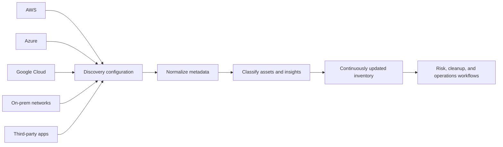

# Architecture

```mermaid
flowchart LR
    AWS[AWS] --> Collect[Discovery configuration]
    Azure[Azure] --> Collect
    GCP[Google Cloud] --> Collect
    OnPrem[On-prem networks] --> Collect
    Third[Third-party apps] --> Collect
    Collect --> Normalize[Normalize metadata]
    Normalize --> Classify[Classify assets and insights]
    Classify --> Inventory[Continuously updated inventory]
    Inventory --> Actions[Risk, cleanup, and operations workflows]
```

Universal Asset Insights is useful because it turns separate discovery sources into one operational inventory that NetOps, CloudOps, and SecOps can share.
