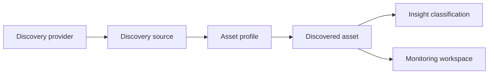

---
    description: "Asset profiles, providers, attributes, and discovery source relationships."
    icon: id-card
    ---

    # Asset profiles and discovery sources

    The source docs include Asset Profiles and Discovery Sources plus provider-specific asset type and attribute references.

## Provider dimensions

* Cloud provider and account metadata.
* Network, DNS, DHCP, and IPAM relationships.
* Security context and endpoint ownership.
* Tags, classifications, and lifecycle status.
