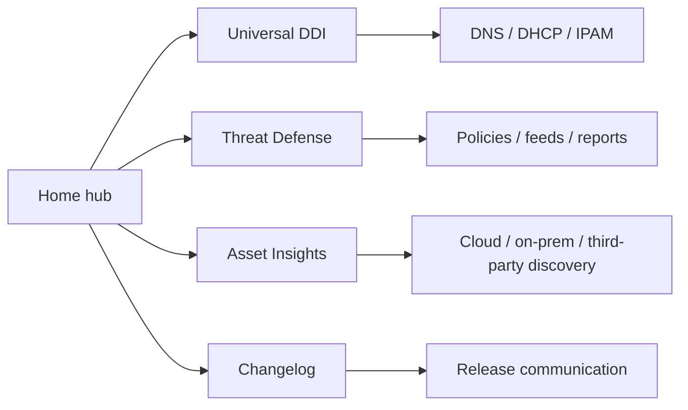

# Documentation Operating Model

## Proposed ownership

| Area | Primary owner | Update cadence |
| --- | --- | --- |
| Universal DDI | NetOps documentation | With service and provider changes |
| Threat Defense | Security product documentation | With policy, endpoint, feed, and report updates |
| Asset Insights | Cloud and asset visibility documentation | With discovery source and architecture updates |
| Changelog | Product documentation operations | Weekly or release-driven |


This draft uses only a few source pages, by design. The structure can scale to the full Infoblox docs estate without making the homepage carry every long-tail topic.

