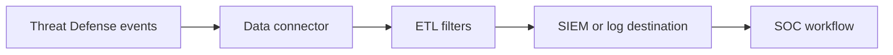

---
    description: "Data connector, destinations, ETL filters, message mappings, and SIEM integrations."
    icon: right-left
    ---

    # Data connector and SIEM

    The source docs include data connector workflows, sources, destinations, ETL filters, Splunk, Splunk Cloud, Logstash, QRadar, ArcSight, McAfee ESM, syslog, DNS query/response mappings, and log monitoring.

