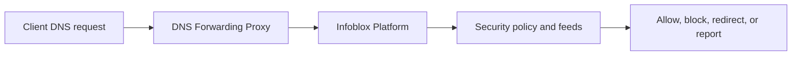

---
    description: "DFP deployment, recursive queries, NIOS best practices, and forwarding to Infoblox."
    icon: route
    ---

    # DNS Forwarding Proxy

    DNS Forwarding Proxy content includes using DFP, best practices for DFP on NIOS, forwarding DNS traffic to Infoblox Platform, recursive query configuration, internal domains, internal resolvers, and DFP service logs.

## Deployment flow

