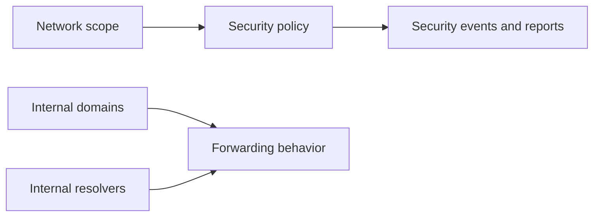

---
    description: "Network scopes, external networks, internal domains, and resolver behavior."
    icon: diagram-project
    ---

    # Network scopes and internal domains

    Threat Defense policy depends on scoping. The source docs include network scopes, external networks, internal domains, imported internal domain lists, and internal resolver behavior for DNS Forwarding Proxy.

## Scope model

## Common tasks

* Create, edit, and remove external networks.
* Configure network scopes for policy application.
* Create and import internal domains.
* Preserve expected resolution for enterprise domains while enforcing DNS-layer security.
