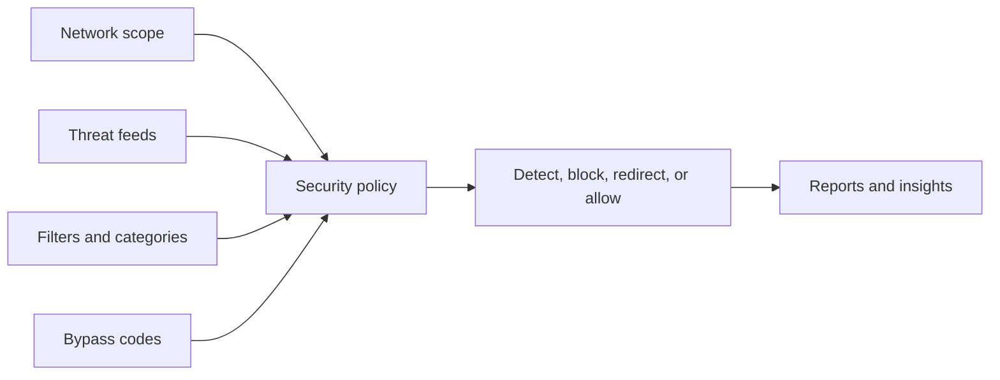

# Security Policy

## Policy checklist

* Define internal networks and domains.
* Choose threat intelligence sources.
* Configure filters and categories.
* Decide when users can bypass.
* Route events to security operations workflows.
