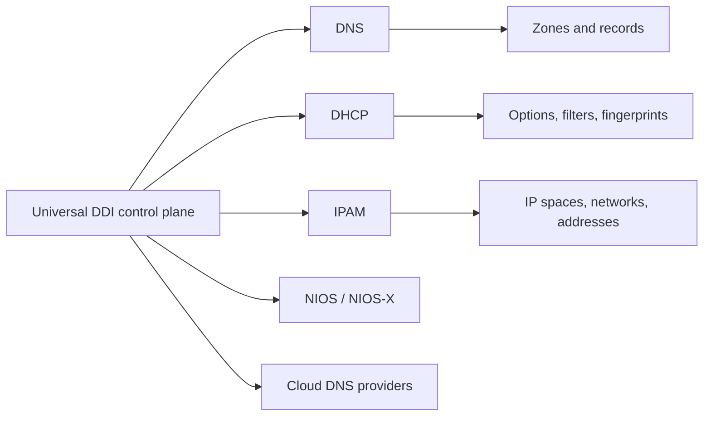

# Core Services

## Common task areas

| Area | Examples |
| --- | --- |
| DNS | Zones, records, ACLs, cache clearing, transfers, DNS servers |
| DHCP | Fixed addresses, option groups, filters, fingerprints |
| IPAM | IP spaces, networks, utilization, discovered resources |
| NIOS-X | Host registration, service deployment, NIOS-X as a Service |
