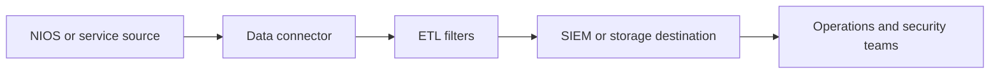

---
    description: "Data connector deployment, ETL filters, destinations, syslog, SIEM, and export health."
    icon: right-left
    ---

    # Data connector and log export

    The source docs contain a large data connector and log export family covering sources, destinations, ETL filters, traffic flows, Splunk, QRadar, ArcSight, Logstash, syslog, monitoring, and message mappings.

## Included task areas

* Deploy and register data connector services.
* Configure sources, destinations, and traffic flows.
* Set up Splunk, Splunk Cloud, QRadar, ArcSight, Logstash, McAfee ESM, and syslog paths.
* Monitor export health and troubleshoot message mappings.
