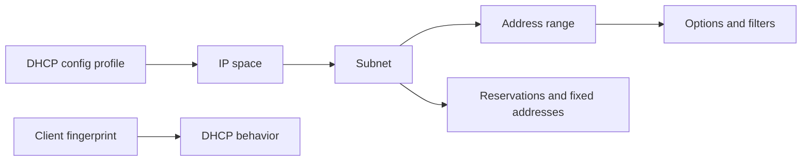

---
    description: "DHCP config profiles, address ranges, options, filters, reservations, and fingerprints."
    icon: ethernet
    ---

    # DHCP services

    DHCP content spans global properties, DHCP config profiles, ranges, reservations, fixed addresses, option groups, option spaces, filters, fingerprints, DDNS updates, and thresholds.

## Operational checklist

* Define global DHCP properties and inheritance defaults.
* Configure DHCP config profiles and associate them with address space.
* Create address ranges, exclusions, reservations, fixed addresses, and option groups.
* Use DHCP fingerprints and filters for client classification.
* Review DHCP lease operation and client request reports.
