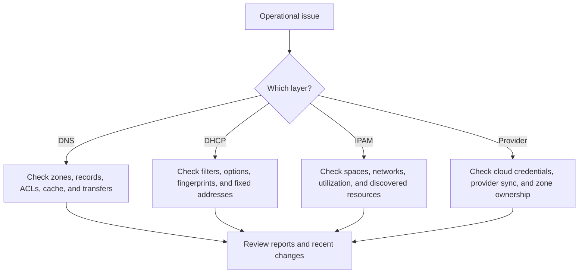

# Troubleshooting Map

```mermaid
flowchart TD
    Issue[Operational issue] --> Type{Which layer?}
    Type -->|DNS| DNS[Check zones, records, ACLs, cache, and transfers]
    Type -->|DHCP| DHCP[Check filters, options, fingerprints, and fixed addresses]
    Type -->|IPAM| IPAM[Check spaces, networks, utilization, and discovered resources]
    Type -->|Provider| Cloud[Check cloud credentials, provider sync, and zone ownership]
    DNS --> Report[Review reports and recent changes]
    DHCP --> Report
    IPAM --> Report
    Cloud --> Report
```
